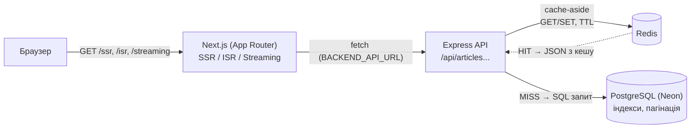

# Архітектура та цільові метрики

## Цільові метрики продуктивності

| Метрика | Що означає | Орієнтир "добре" (Web Vitals / Lighthouse) |
|---|---|---|
| **TTFB** (Time To First Byte) | Час від запиту до першого байта відповіді сервера | ≤ 0.8с |
| **FCP** (First Contentful Paint) | Час до першого візуального контенту на екрані | ≤ 1.8с |
| **LCP** (Largest Contentful Paint) | Час до відображення найбільшого видимого елемента | ≤ 2.5с |
| **TTI** (Time To Interactive) | Час до повної інтерактивності сторінки | ≤ 3.8с |

## Критерії "до/після"

У цьому проєкті "до" і "після" визначені як два реально відтворювані стани системи
(не гіпотетичні), щоб порівняння можна було виміряти, а не просто задекларувати:

1. **Кешування (backend):** "до" = `DISABLE_CACHE=true` (кожен запит іде в Neon),
   "після" = Redis-кеш увімкнено (типовий режим). Перемикається без зміни коду.
2. **Стратегія рендерингу (frontend):** "до" = SSR (`force-dynamic`, рендеринг і
   мережевий запит до API при кожному відкритті сторінки), "після" = ISR (кеш сторінки
   з фоновою ревалідацією) або Streaming SSR (швидкий перший рендер, повільний контент
   не блокує показ сторінки) — залежно від того, яку властивість оптимізуємо
   (пропускну здатність чи сприйняту швидкість).
3. **Вибір полів у SQL (backend):** "до" = гіпотетичний `SELECT *` (включно з важким
   полем `content`), "після" = вибірка лише полів, потрібних для списку. Виміряно
   як економія обсягу відповіді (див. `performance-report.md`).

## Архітектура бекенду

- **API-шар** (`backend/src/routes`, Express): REST-ендпоінти `GET /api/articles`,
  `GET /api/articles/:slug`, `POST /api/articles/:slug/view`.
- **Шар кешування** (`backend/src/cache`, Redis/ioredis): cache-aside (`getOrSetCache`),
  TTL 30с для списку / 60с для деталей, інвалідація при записі, resilient fallback
  (Redis недоступний → працює напряму з БД).
- **Шар роботи з БД** (`backend/src/db`, PostgreSQL/Neon): пул з'єднань `pg`,
  SQL-міграції, індекс по `published_at` (сортування/пагінація) та унікальний по
  `slug`, offset-пагінація (`LIMIT`/`OFFSET`), вибірка лише потрібних полів у списку.

## Схема взаємодії

## CDN/edge кешування (теоретично)

У поточному локальному запуску (`npm run start` на власній машині) CDN/edge-шару
немає — його неможливо змістовно продемонструвати без реального деплою. Якби
проєкт розгортався на платформі на кшталт Vercel або за Cloudflare:

- **Статичні ресурси** (JS/CSS-чанки Next.js, зображення) кешувалися б на edge
  автоматично, з `Cache-Control: immutable` — це вже відбувається "з коробки" при
  `next build`, просто без CDN перед сервером немає кому це кешувати географічно.
- **`/isr`-сторінка** — головний кандидат на edge-кешування: після першої генерації
  HTML можна кешувати на CDN-вузлах ближче до користувача (а не лише в пам'яті
  Node-процесу), а `revalidate` синхронізував би інвалідацію на edge так само,
  як зараз синхронізує її локально (Vercel робить це нативно для Next.js ISR).
- **`/ssr`** з `force-dynamic` за визначенням не кешується на edge (дані мають бути
  свіжими щоразу) — CDN тут допоміг би хіба що з TLS-термінацією/маршрутизацією
  ближче до користувача, але не з кешуванням відповіді.
- **Ефект для TTFB**: для користувача, географічно віддаленого від сервера, edge-кеш
  прибирає більшу частину мережевої затримки (RTT) до origin — аналогічно до того,
  як Redis прибирає затримку до Neon у наших вимірах (Розділ 2 `performance-report.md`),
  тільки на рівень вище (мережа користувач↔сервер замість сервер↔БД).

## Профілювання

Реальний профіль backend під навантаженням (`node --prof`) — [`profiling/README.md`](./profiling/README.md).
Головний висновок: backend I/O-bound (76% часу — очікування на Redis/Neon, не
виконання коду), що пояснює, чому кешування дало найбільший ефект серед усіх
оптимізацій.

Детальні виміряні результати — у [`performance-report.md`](./performance-report.md).
